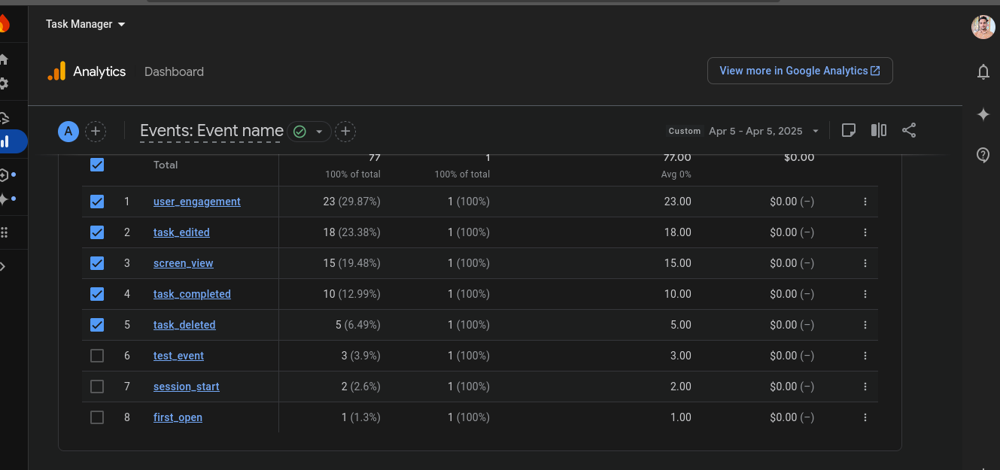
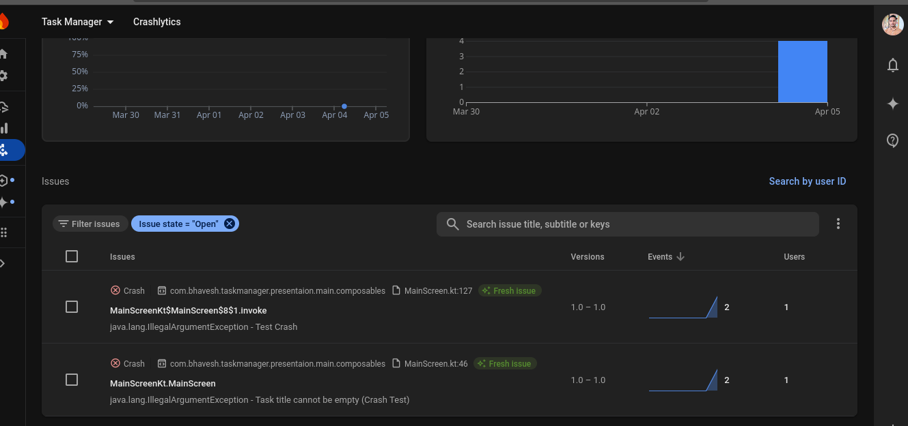
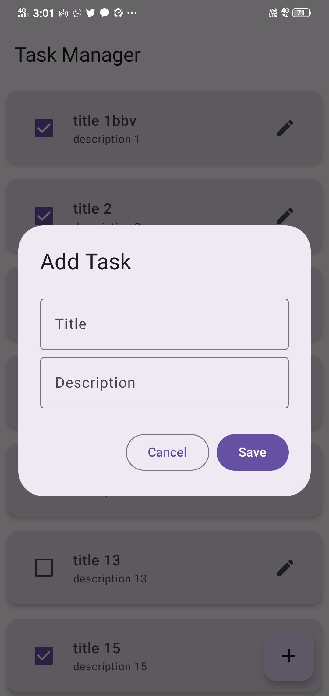
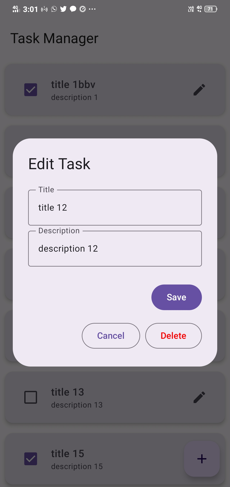
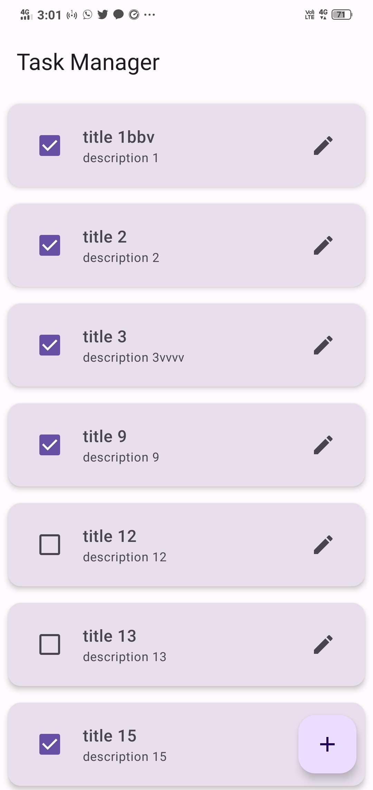

# 📋 Task Manager App

A modern Android app to manage your daily tasks, built with **Jetpack Compose**, **MVVM architecture**, and powered by **Firebase Analytics**. Users can add, update, complete, and delete tasks. Events, crashes, and network performance are tracked using **Firebase**.

---

## ⚙️ Setup Instructions

### 1. Clone the Repo

```bash
git clone https://github.com/bhavesh100/task-manager.git
```

### 2. Open in Android Studio

Open the project and let Gradle sync. If prompted, install missing dependencies.

### 4. Run the App

Build and run the app on an emulator or real device (Android 6.0+).

---

## 📦 Third-Party Libraries

| Library                         | Purpose                          |
|----------------------------------|-----------------------------------|
| **Jetpack Compose**              | Modern UI Toolkit                 |
| **Firebase Analytics**           | User events tracking              |
| **Firebase Crashlytics**         | Crash reporting                   |
| **Hilt (Dagger)**                | Dependency injection              |
| **Material 3**                   | UI components                     |

## 🧠 Design Decisions

### Architecture

- **MVVM** for separation of concerns.
- **Jetpack Compose** for UI simplicity and reactivity.
- **Hilt** to inject `ViewModel` and data sources.
- **Scaffold + LazyColumn** for screen layout.
- **Firebase Analytics** to track events like task add/edit/delete/complete.
- **Crashlytics** to monitor issues in production.
- **SnackbarHost** for user feedback on success or error.

### Event Logging

```kotlin
firebaseAnalytics.logEvent("task_completed", Bundle().apply {
    putString("task_title", task.title)
})
```

---

## 📊 Firebase Analytics Events

### Events Logged:

| Event Name      | When It Happens             | Parameters        |
|------------------|-----------------------------|--------------------|
| `task_added`     | User adds a new task        | `task_title`       |
| `task_edited`    | Task is updated             | `task_title`       |
| `task_deleted`   | Task is deleted             | `task_title`       |
| `task_completed` | Task is marked complete     | `task_title`       |

### Screenshots

- 

---

## ⚠️ Crash Reporting

### Reproducible Crash

- Add task → crash when user will delete task (intentional for testing)

### Crashlytics Screenshot

- 

### Screen Recording of Crash


- [Crash Recording (MP4)](media/crash_demo.mp4)

## 📱 UI Screens

| Add Task | Edit Task | Task List |
|----------|-----------|---------------|
|  |  |  |

---

## 📌 Notes

- Firebase initialization is in `TaskManagerApp.kt`
- Firebase analytics used with `remember { Firebase.analytics }` inside Composables
- Crashlytics is automatically initialized using Hilt and Firebase SDKs

---

## 🙋‍♂️ Author

**Bhavesh Kumawat**  
[GitHub](https://github.com/bhavesh100) | [LinkedIn](https://linkedin.com/in/bhavesh-kumawat-05a211207)

---


